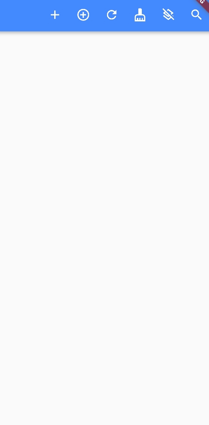
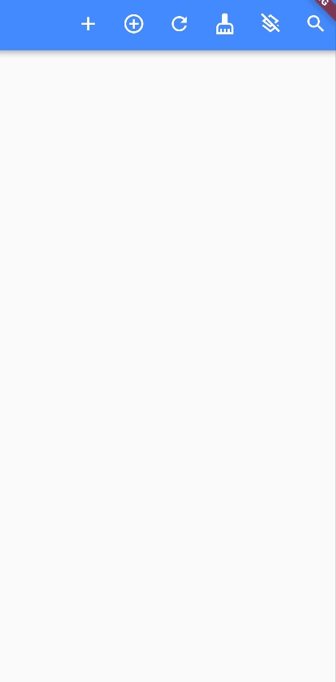

# foldable_list_ml

A foldable list package that provides maximum display configuration.

Similar to ListTile, but implemented using InkWell,
thus providing more configuration content.

## Getting Started

### Depend on it

Add this to your package's pubspec.yaml file:

```
dependencies:
  foldable_list_ml: [latest version]
```

## Example

- Add common widget to display (first button)

But it's valid and is not recommended because you cannot remove it normally.
If valid widgets are added to contents, use `tileManager.removeValidWidgets();` to remove.



- Add, Remove the [FoldableList](#---boundfoldablelist) and [TileItem](#---boundtileitem), Expend list



See Example page for example code.

You can decorate the widget as needed, and the above demonstration is an undecorated widget.

## Usage

Where is `root` or `rootContents`?
It's in the `TileManager._rootContents.contents`, the contents
where you want to display the widgets(`tileManager.buildList() => List<Widget>`)

In `State`:
- Create TileManager:

```dart
    late TileManager tileManager;

    @override
    void initState() {
      super.initState();
      /// Init tileManager with setState method in this state,
      /// cannot give setState directly, e.g., TileManager(widgetSetState: setState);
      tileManager = TileManager(rebuildState: () {setState(() {});});
    }
```

- Set where you want to display

In `State#build`:

```dart
    @override
    Widget build(BuildContext context) {
      return Scaffold(
          body: Column(
            // Here to display the contents
            children: tileManager.buildList(),
          )
      );
    }
```

- Add components to root:

```dart
    exampleAddToRoot(TileManager boundManager) {
      // Create ContextController
      ContextController controller = Controller(boundManager: boundManager);
      // Add a BoundFoldableList to rootContents
      boundManager.addToRoot(
          BoundFoldableList(
              controller: controller,
              ...
          )
      );
    }
```

- Add components to BoundFoldableList

```dart
    BoundFoldableList createFoldableList(TileManager boundManager) {
      ContextController controller = ContextController(boundManager: boundManager);
      return BoundFoldableList(
        // Give a unique key
        key: UniqueKey(),
        controller: controller,
        title: const Text("new foldable"),
        leading: IconButton(
            onPressed: () {
              // use controller to add new BoundTileItem
              controller.add(
                  createBoundTileItem(boundManager)
              );
            },
            icon: const Icon(Icons.add)
        ),
        trailing: IconButton(
          onPressed: () {
            // Use controller to remove itself
            controller.remove();
          },
          icon: const Icon(Icons.remove),
        ),
      );
    }

    BoundTileItem createBoundTileItem(TileManager boundManager) {
      ContextController controller = ContextController(boundManager: boundManager);
      return BoundTileItem(
        controller: controller,
        // pack Text to it
        title: const Text('new bound tile item'),
        trailing: IconButton(
          onPressed: () {
            controller.remove();
          },
          icon: const Icon(Icons.remove),
        ),
      );
    }
```

### -- TileItem

Having the same properties as [InkWell](https://api.flutter.dev/flutter/material/InkWell-class.html) except for [Key], child
and the same properties as [Container](https://api.flutter.dev/flutter/widgets/Container-class.html) except for [Key], child.
And the following is additional content:

| Property    | Description                                  | Default                 |
|-------------|----------------------------------------------|-------------------------|
| title       | A widget used as title, mostly a Text widget | null                    |
| leading     | A widget in the head of the tile             | null                    |
| trailing    | A widget in the tail of the tile             | null                    |
| titleMargin | The edgeInsets between the leading and title | default EdgeInsets.zero |

### -- BoundTileItem

Having the same properties as [TileItem](#---tileitem).
And the following is additional content:

| Property                                          | Description                                            | Default       |
|---------------------------------------------------|--------------------------------------------------------|---------------|
| **@required** [controller](#---contextcontroller) | A context control for binding TileItem and TileManager | **@required** |

### -- FoldableList

Having the same properties as [TileItem](#---tileitem).
And the following is additional content:

| Property                                 | Description                                                       | Default       |
|------------------------------------------|-------------------------------------------------------------------|---------------|
| **@required** title                      | Same as [TileItem](#---tileitem) but required                     | **@required** |
| **@required** [statePack](#---statepack) | A pack which store the stateChildren and the rebuildStateCallBack | **@required** |

### -- BoundFoldableList

BoundFoldableList extends FoldableList with all the property of it.
And the following is additional content:

| Property                                          | Description                                                                          | Default       |
|---------------------------------------------------|--------------------------------------------------------------------------------------|---------------|
| **@required** [key]                               | You must give a unique key.If not, it will cause state binding errors                | **@required** |
| **@required** [controller](#---contextcontroller) | A context control for binding FoldableList and TileManager                           | **@required** |
| stateChildren                                     | A List<Widget> to display in the state of [BoundFoldableList](#---boundfoldablelist) | []            |

### -- StatePack

| Property                     | Description                                                                          | Default |
|------------------------------|--------------------------------------------------------------------------------------|---------|
| initExpended                 | Is expended when create                                                              | true    |
| stateChildren                | A List<Widget> to display in the state of [BoundFoldableList](#---boundfoldablelist) | []      |
| rebuildStateFunctionCallBack | A call back to call back the rebuildState function in the state                      | null    |

### -- ContextController

| Property                                      | Description                    | Default       |
|-----------------------------------------------|--------------------------------|---------------|
| **@required** [boundManager](#---tilemanager) | Which manager you need to bind | **@required** |

### -- TileManager

| Property                   | Description                                                                                                                                 | Default       |
|----------------------------|---------------------------------------------------------------------------------------------------------------------------------------------|---------------|
| **@required** rebuildState | the setState function of which state use it to display contents,<br/>(please use `() {setState(() {});}` instead of us `setState` directly) | **@required** |

## ToDo list

[x] Complete component and InkWell style compatibility.

[x] Rewrite the focus in FoldableList and TileItem.

[x] Add more packed components with default styles.

[x] Add a root list widget to wrap tileManager.buildList().

[x] Add animations for adding, removing, clearing, and expending.

## Contributing

Welcome everyone to provide new suggestions and contributions to this package.

## Versioning

- **V0.1.0** - Initial Release.

## Authors

**Morlinnn** - [Github](https://github.com/Morlinnn)

## License

This project is licensed under the MIT License - see the [LICENSE.md](LICENSE) file for details

[Key]: https://api.flutter.dev/flutter/foundation/Key-class.html